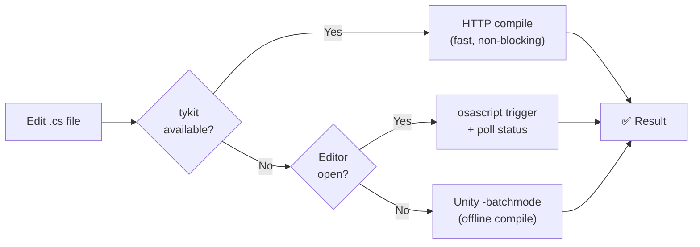
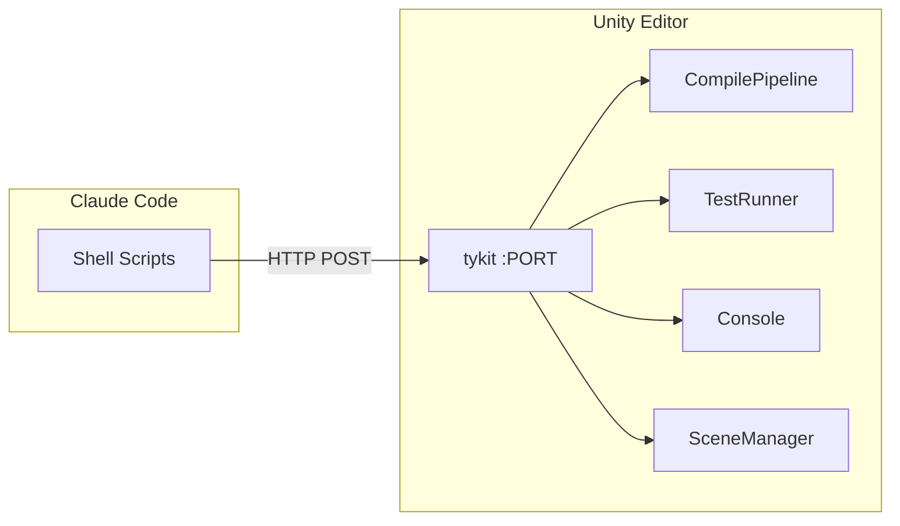
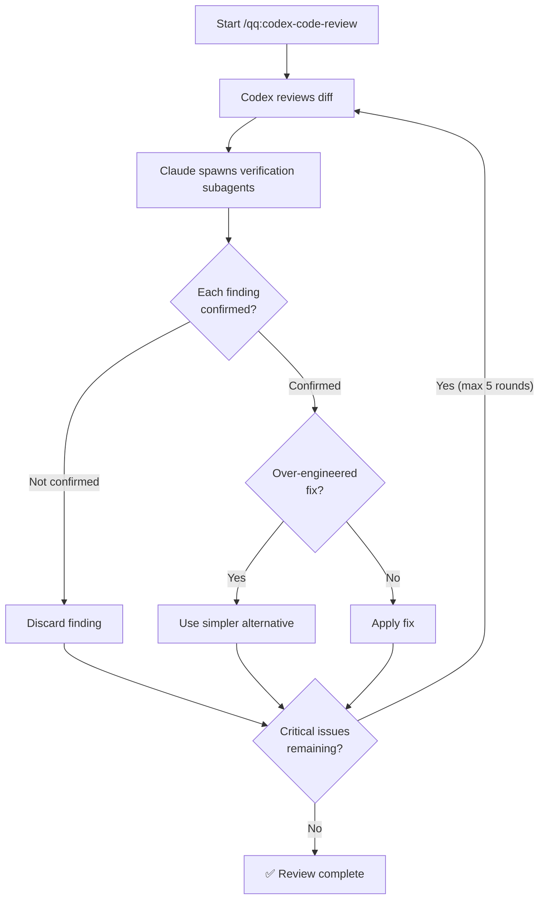
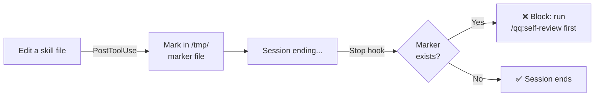
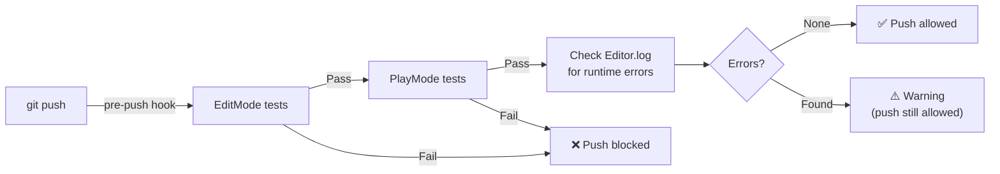
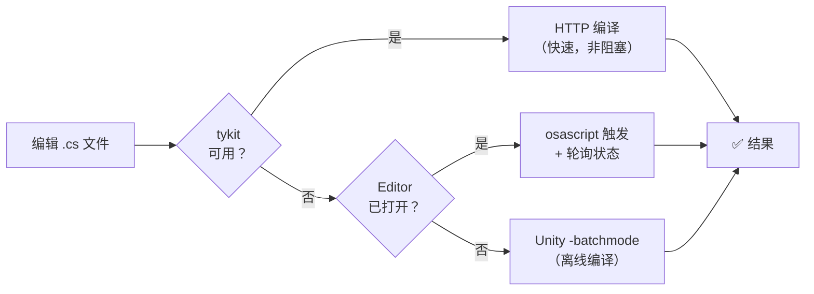
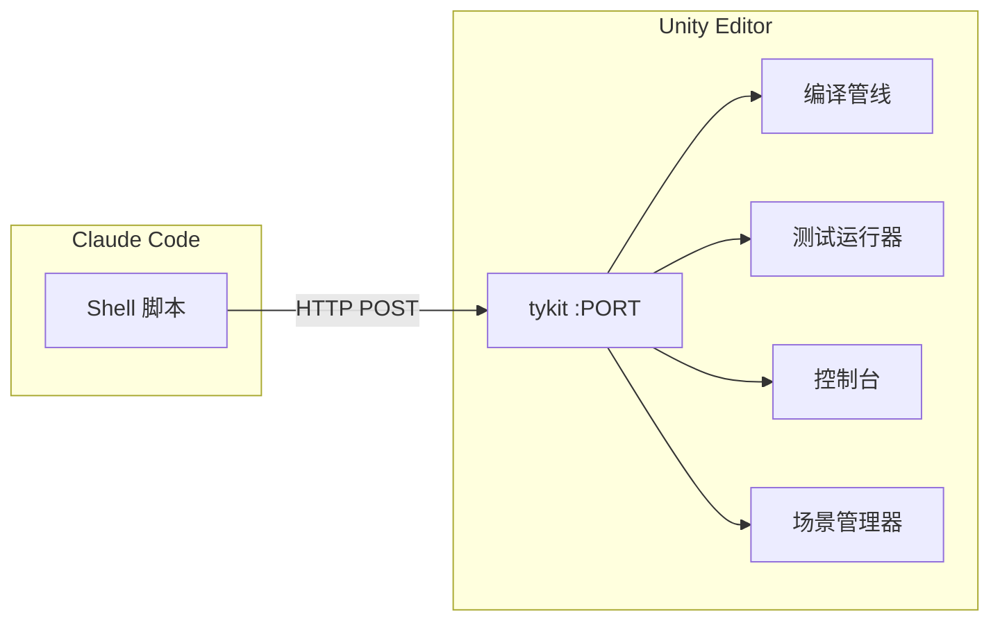
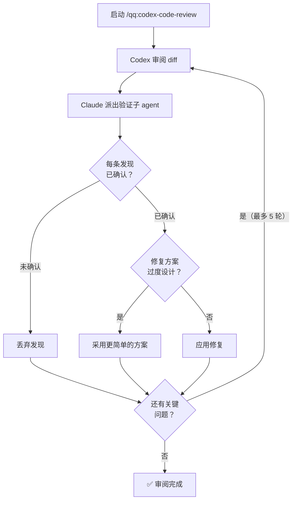
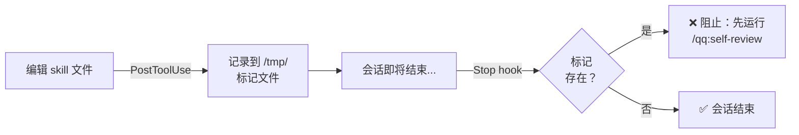

<p align="center">
  
</p>

<h1 align="center">quick-question</h1>

<p align="center">
  <strong>Unity Agent Harness for Claude Code</strong><br>
  Auto-compile, test pipelines, cross-model code review — out of the box.
</p>

<p align="center">
  <a href="https://github.com/tykisgod/quick-question/actions/workflows/validate.yml"></a>
  <a href="https://github.com/tykisgod/quick-question/blob/main/LICENSE"></a>
  
  
  
  <a href="https://github.com/tykisgod/quick-question/stargazers"></a>
</p>

<p align="center">
  <a href="#english">English</a> |
  <a href="#中文">中文</a> |
  <a href="#日本語">日本語</a> |
  <a href="#한국어">한국어</a>
</p>

---

# English

## What It Does

> Edit → Compile → Test → Review → Ship. Fully automated.

🔧 **Auto-Compilation** — Edit a `.cs` file, compilation runs automatically via hook
🧪 **Test Pipeline** — EditMode + PlayMode tests with runtime error checking
🔍 **Cross-Model Review** — Claude orchestrates, Codex reviews, every finding verified against source
⚡ **15 Slash Commands** — test, commit, review, explain, dependency analysis, and more
🎮 **tykit** — HTTP server inside Unity Editor for AI agent control (play/stop/console/run tests)

```
Edit .cs file
     │ (PostToolUse hook)
     ▼
┌──────────────────┐
│  Smart Compile   │──── tykit (fast) / Editor trigger / Batch mode
└────────┬─────────┘
         ▼
┌──────────────────┐
│   /qq:test       │──── EditMode + PlayMode + error check
└────────┬─────────┘
         ▼
┌──────────────────────────┐
│  /qq:codex-code-review   │──── Codex reviews → Claude verifies → fix → loop
└────────┬─────────────────┘
         ▼
┌──────────────────┐
│  /qq:commit-push │──── commit + push
└──────────────────┘
```

## A Day with qq

> Alex is working on a GTA-style open world game in Unity. 200k lines of C#, 15 service modules, 4 developers. She just installed qq. Here's her Tuesday.

**9:00 AM — Start coding**

Alex asks Claude to add a vehicle health system — cars should take damage from collisions, catch fire at low HP, and explode. Claude writes `VehicleDamageSystem.cs`, `FireEffect.cs`, and modifies `CollisionHandler.cs`.

She doesn't run any compile command. Each time Claude saves a `.cs` file, a hook fires automatically:

```
⚙️ Compiling Unity... ✅ Compilation successful (1.2s)
```

Three files edited, three automatic compiles. She doesn't even notice.

**9:30 AM — Run tests**

```
/qq:test
```

```
EditMode:  186/186 passed
PlayMode:   42/42 passed
Runtime errors: 1 found
  [Error] NullReferenceException at VehicleDamageSystem.cs:34
  Source: VehicleDamageSystem.OnEnable() — _rigidbody not assigned
```

All 228 tests "passed", but qq caught a runtime error hiding in the console — a `GetComponent` that runs before the Rigidbody is ready. Claude reads the code, moves the call to `Start()`, auto-compiles. Clean.

**10:00 AM — A new team member asks: "How does our damage system work?"**

```
/qq:grandma "vehicle damage system"
```

> "Imagine every car is a balloon. Crashing into things pokes tiny holes — that's damage. When enough holes open up, air leaks out fast — that's the fire stage. Eventually there's no air left, and the balloon pops — that's the explosion. The armor stat is like how thick the balloon's skin is."

The new dev gets it in 30 seconds.

Later, Alex needs to explain the **module architecture** to the tech lead:

```
/qq:explain VehicleDamageSystem
```

Claude reads the source and design docs, then outputs a structured breakdown: responsibilities, dependencies, data flow, and key design decisions. Technical but clear.

**10:30 AM — The fire VFX feels wrong**

Alex isn't sure how other games handle vehicle fire progression.

```
/qq:research
```

| Game | Fire Model | Pros | Cons |
|------|-----------|------|------|
| GTA V | HP threshold stages (smoke → fire → explosion) | Intuitive, cinematic | Rigid, no player agency |
| Assassin's Creed | Damage-over-time with spread | Realistic | Complex, hard to balance |
| Just Cause | Instant explosion at threshold | Simple, satisfying | No warning for player |

Alex picks the GTA V model — three visual stages based on HP thresholds. Proven, players already understand it.

**11:00 AM — Check module dependencies before going deeper**

```
/qq:deps
```

Claude scans all `.asmdef` files, generates a Mermaid dependency graph and a matrix table. Alex spots that `VehicleSystem` accidentally depends on `WeaponSystem` — a layer violation. She fixes the dependency before it spreads.

```
/qq:deps VehicleSystem
```

This time just the upstream/downstream of `VehicleSystem` — a focused view showing exactly what it touches.

**11:30 AM — Check if the design doc is still accurate**

```
/qq:doc-drift --module vehicle
```

Claude compares the vehicle design doc against actual code. Found 2 mismatches: the doc says fire starts at 30% HP, code uses 25%. And a planned "repair mechanic" is documented but not implemented yet — marked as "not yet built, not a bug."

**2:00 PM — Cross-model code review before asking the team to review**

```
/qq:codex-code-review
```

The diff is sent to Codex for review. ~5 minutes later, findings come back. A **Review Gate** activates — Claude can't edit any code until each finding is verified by an independent subagent.

```
=== Round 1/5 ===

Codex found:
  [Critical] VehicleDamageSystem applies damage during respawn — no isDead guard
  [Medium] FireEffect instantiates VFX every frame — should pool
  [Suggestion] CollisionHandler.OnCollisionEnter allocates a new List every call

Dispatching 2 verification subagents...

  [Critical] isDead guard: CONFIRMED — VehicleDamageSystem.cs:47, no check
  [Medium] VFX pooling: CONFIRMED — FireEffect.cs:23, Instantiate in Update

Gate unlocked. Fixing confirmed issues...
  ✅ Compiled. 186/186 EditMode, 42/42 PlayMode passed.

=== Round 2/5 ===
No [Critical] issues. Review passed.
```

> *Tip: `/qq:claude-code-review` does the same thing without needing Codex CLI — uses Claude subagents instead. Same Gate, same verification loop, no external dependency.*

**3:00 PM — Generate review materials for the team**

```
/qq:full-brief
```

Two agents run in parallel. Four documents land in `Docs/qq/`:

```
arch-review     — Mermaid diagram: VehicleDamageSystem → Rigidbody, FireEffect → VFXPool
pr-review       — P0: isDead guard, P1: VFX pooling, P2: List allocation
timeline-arch   — Phase 1: base damage, Phase 2: fire stages, Phase 3: explosion + respawn
timeline-review — review items grouped by development phase
```

These aren't PR description copy-paste — they're structured materials for human reviewers. The tech lead opens the arch diagram, traces the dependency flow, then reads the P0 items. Review done in 15 minutes instead of an hour.

**3:30 PM — What did we do today?**

```
/qq:changes
```

Claude summarizes: 3 new files, 2 modified, 1 bug fixed (isDead guard), 1 performance fix (VFX pooling). Ready to write the commit messages.

**3:45 PM — Before committing, one more check**

```
/qq:code-review
```

A quick project-specific review — checks against the team's own rules in `AGENTS.md`: no `FindObjectOfType` in runtime, no missing `OnDestroy` cleanup, no cross-module dependency violations. Catches that `FireEffect` doesn't unsubscribe from `OnDamageChanged` in `OnDestroy`. Fixed.

**4:00 PM — Ship it**

```
/qq:commit-push
```

Claude groups changes into 3 logical commits:
- `feat: vehicle damage system with HP-based collision damage`
- `feat: fire VFX stages (smoke → fire → explosion)`
- `fix: isDead guard + VFX pooling + event cleanup`

Pre-push hook runs tests one last time:

```
[pre-push] EditMode 186/186 ✅ PlayMode 42/42 ✅
[pre-push] Runtime errors: 0
All tests passed, push allowed.
```

**4:15 PM — The repo is getting messy**

Over the past month, design docs, review outputs, and temp specs have piled up everywhere.

```
/qq:doc-tidy
```

Claude scans the entire repo, categorizes 47 doc files, and outputs a cleanup plan:
- 12 temp review files → archive
- 5 duplicate design docs → merge
- 3 orphaned docs referencing deleted modules → delete
- Root directory has 8 files that should be in `Docs/`

Alex reviews the plan, approves, and the repo is clean again.

**End of day**

```
/qq:timeline
```

Looking at the branch history, the timeline skill groups 11 commits into 3 semantic phases:
1. Core damage system (commits 1-4)
2. Fire VFX stages (commits 5-8)
3. Bug fixes and cleanup (commits 9-11)

Each phase has its own architecture evolution doc and code review checklist. Perfect for the Friday team review meeting.

---

> Every step had a safety net. Auto-compile caught syntax errors instantly. Tests caught logic bugs. Runtime error checking caught hidden exceptions. Cross-model review caught design flaws. The Gate prevented premature fixes. Pre-push hook was the final checkpoint.
>
> Alex never had to remember "which command should I run now." The harness guided her.

## Prerequisites

| Requirement | Notes |
|-------------|-------|
| macOS | v1 limitation — Windows/Linux planned for v2 |
| Git | Required — hooks and review commands depend on it |
| Unity 2021.3+ | Required by tykit |
| [Claude Code](https://docs.anthropic.com/en/docs/claude-code) | CLI or IDE extension |
| curl, python3, jq | `brew install curl python3 jq` |
| [Codex CLI](https://github.com/openai/codex) | Optional — only for cross-model review |

## Install

### Step 1: Install Plugin (skills + hooks)

In Claude Code:
```
/plugin marketplace add tykisgod/quick-question
/plugin install qq@quick-question-marketplace
```

This gives you all 15 skills and hooks (auto-compile, skill review enforcement). No files are copied into your project — the plugin runs from its cache.

### Step 2: Install tykit (Unity package)

tykit is the HTTP server that lets Claude control Unity Editor:

```bash
git clone https://github.com/tykisgod/quick-question.git /tmp/qq-install
/tmp/qq-install/install.sh /path/to/your-unity-project
rm -rf /tmp/qq-install
```

The installer handles Unity-specific setup:
- Adds tykit to `Packages/manifest.json`
- Copies shell scripts to `scripts/`
- Creates `CLAUDE.md` and `AGENTS.md` from templates (only if missing, never overwrites)

## Quick Start

After installation, open your Unity project and start Claude Code:

```bash
# Run tests and check for errors
/qq:test

# Run PlayMode only
/qq:test play

# Filter by test name
/qq:test --filter "Health"

# Cross-model code review
/qq:codex-code-review

# Commit and push
/qq:commit-push
```

## Commands

| Command | Description |
|---------|-------------|
| **Testing** | |
| `/qq:test` | Run unit/integration tests with error checking |
| **Code Review (Codex)** | *Requires [Codex CLI](https://github.com/openai/codex)* |
| `/qq:codex-code-review` | Cross-model code review (Claude + Codex with verification) |
| `/qq:codex-plan-review` | Cross-model design document review |
| **Code Review (Claude-only)** | *No extra tools needed* |
| `/qq:claude-code-review` | Deep code review using Claude subagents |
| `/qq:claude-plan-review` | Deep design document review using Claude subagents |
| **Code Review (Quick)** | |
| `/qq:code-review` | Project-specific review (reads your `AGENTS.md` rules) |
| `/qq:self-review` | Review skill/config changes for quality |
| **Analysis** | |
| `/qq:brief` | Architecture diff + PR checklist (2 docs) |
| `/qq:timeline` | Commit history timeline with phase analysis (2 docs) |
| `/qq:full-brief` | Run brief + timeline in parallel (4 docs total) |
| `/qq:deps` | `.asmdef` dependency graph + matrix + health check |
| **Utilities** | |
| `/qq:commit-push` | Batch commit and push |
| `/qq:explain` | Explain module architecture in plain language |
| `/qq:grandma` | Explain any concept using everyday analogies anyone can understand |
| `/qq:research` | Search open-source solutions for current problem |
| `/qq:changes` | Summarize all changes in current conversation |
| `/qq:doc-tidy` | Scan repo docs, analyze organization, suggest cleanup |
| `/qq:doc-drift` | Compare design docs vs code, find inconsistencies |

## How It Works

### Auto-Compilation (PostToolUse Hook)

Every time Claude edits a `.cs` file, a PostToolUse hook triggers smart compilation:



### tykit

An HTTP server that auto-starts inside Unity Editor. Port is determined by project path hash, stored in `Temp/eval_server.json`.



**Available commands:**

| Command | Description |
|---------|-------------|
| `status` | Editor state overview |
| `compile-status` / `get-compile-result` | Compilation status and errors |
| `run-tests` / `get-test-result` | Run and poll EditMode/PlayMode tests |
| `play` / `stop` | Control Play Mode |
| `console` | Read console logs (with filter support) |
| `find` / `inspect` | Find and inspect GameObjects |
| `refresh` / `save-scene` / `clear-console` | Editor utilities |

### Cross-Model Review (Tribunal)

Two AI models reviewing each other's work with automatic verification:



**Review Gate:** While verification subagents are running, a PreToolUse hook blocks edits to `.cs` files and `Docs/*.md` — preventing premature fixes before findings are confirmed.

### Skill Review Enforcement (Stop Hook)



### Pre-Push Testing (Git Hook, Optional)

Automatically runs EditMode + PlayMode tests before every `git push`. If tests fail, the push is blocked.

```bash
# Install with pre-push hook
./install.sh /path/to/project --with-pre-push

# Skip for a single push
git push --no-verify
```



## All Hooks Summary

| Hook | Trigger | What It Does | Default | Impact |
|------|---------|-------------|:-------:|--------|
| **Auto-compile** | Edit .cs file | Runs smart compilation | On | Every .cs edit |
| **Skill change marker** | Edit skill file | Records change for self-review | On | Only when editing skills |
| **Self-review enforcement** | Session ending | Blocks if unreviewed skill changes | On | Only when skills were edited |
| **Review Gate (set)** | Run code-review.sh | Locks code edits until verified | On | Only during `/qq:codex-*` reviews |
| **Review Gate (check)** | Edit .cs / docs | Blocks if gate is locked | On | Only when gate is active |
| **Review Gate (count)** | Subagent completes | Unlocks gate after verification | On | Only when gate is active |
| **Gate cleanup** | Session ending | Clears gate marker | On | Automatic, no impact |
| **Pre-push testing** | git push | Runs tests, blocks on failure | **Off** | Every push (when enabled) |

### Disabling Hooks

The Review Gate hooks only activate during cross-model review — **zero impact** on normal development.

To disable auto-compilation or self-review enforcement, override in your project's `.claude/settings.local.json`:

```json
{
  "hooks": {
    "PostToolUse": [{ "matcher": "Write|Edit", "hooks": [] }],
    "Stop": [{ "matcher": "", "hooks": [] }]
  }
}
```

This disables **all** PostToolUse and Stop hooks. To disable only specific ones, keep the hooks array but remove the entry you don't want.

To remove the pre-push hook:
```bash
rm .githooks/pre-push
git config --unset core.hooksPath
```

## Comparison

| Feature | quick-question | Typical AI Tools |
|---------|:---:|:---:|
| Auto-compile on edit | ✅ Hook-driven | ❌ Manual |
| Test pipeline | ✅ EditMode + PlayMode + error check | ❌ Manual |
| Cross-model review | ✅ Claude + Codex with verification loop | ⚠️ Single model |
| Runtime Editor control | ✅ tykit (HTTP) | ❌ No access |
| Skill review enforcement | ✅ Stop hook blocks until reviewed | ⚠️ Honor system |
| Scene restoration | ✅ Auto-restores after PlayMode tests | ❌ Left on test scene |
| Pre-push test gate | ✅ Optional git hook | ❌ None |

## Customization

### CLAUDE.md

Your coding standards. The auto-compilation hook and test commands respect whatever rules you define here. See [`templates/CLAUDE.md.example`](templates/CLAUDE.md.example) for Unity-specific defaults.

### AGENTS.md

Your architecture rules and review criteria. The `/qq:code-review` and cross-model review commands read this file to detect anti-patterns and module boundary violations. See [`templates/AGENTS.md.example`](templates/AGENTS.md.example) for a starting template.

### Priority System

All review commands classify findings by impact:

| Priority | Scope | Action |
|----------|-------|--------|
| **P0** | Architecture changes, anti-patterns, lifecycle issues | Must review |
| **P1** | Business logic, performance, error handling | Worth reviewing |
| **P2** | Getters/setters, logging, config tweaks | Quick scan |

## Limitations

- **macOS only** (v1) — scripts use `osascript`, `/Applications/Unity`, `~/Library/Logs`
- **Codex CLI required** for cross-model review features
- **Unity 2021.3+** required by tykit package
- **tykit is localhost-only, no authentication** — acceptable for dev machines, not for shared/CI environments
- **Console log scraping** for compile verification — use `clear-console` before critical compiles to avoid stale errors

## Contributing

Contributions are welcome! Please open an issue or submit a pull request.

## License

[MIT](LICENSE) © Yukang Tian

---

# 中文

## 功能

> 编辑 → 编译 → 测试 → 审阅 → 发布，全自动。

🔧 **自动编译** — 编辑 .cs 文件后自动编译验证
🧪 **测试流水线** — EditMode + PlayMode 测试 + 运行时错误检查
🔍 **跨模型审阅** — Claude 编排，Codex 审阅，每条发现逐一验证
⚡ **15 个斜杠命令** — 测试、提交、审阅、解释、依赖分析等
🎮 **tykit** — Unity Editor 内的 HTTP 服务器，AI agent 可控制

```
编辑 .cs 文件
     │ (PostToolUse hook)
     ▼
┌──────────────────┐
│    智能编译      │──── tykit（快速）/ Editor 触发 / Batch 模式
└────────┬─────────┘
         ▼
┌──────────────────┐
│   /qq:test       │──── EditMode + PlayMode + 错误检查
└────────┬─────────┘
         ▼
┌──────────────────────────┐
│  /qq:codex-code-review   │──── Codex 审阅 → Claude 验证 → 修复 → 循环
└────────┬─────────────────┘
         ▼
┌──────────────────┐
│  /qq:commit-push │──── 提交 + 推送
└──────────────────┘
```

## qq 的一天

> 小明在做一个类 GTA 的开放世界游戏。20 万行 C#，15 个模块，4 个开发者。他刚装好 qq。

**9:00 — 写代码**

让 Claude 写载具伤害系统——碰撞扣血、低血着火、爆炸。Claude 写了 3 个文件，每次保存 hook 自动编译，他什么都不用做。

**9:30 — 跑测试** — `/qq:test`。186 个测试全过，但 qq 在 console 抓到一个隐藏的 NullRef。Claude 修了。

**10:00 — 新人问"伤害系统怎么运作"** — `/qq:grandma "vehicle damage"`。用气球比喻：碰撞戳洞 = 伤害，漏气 = 着火，爆掉 = 爆炸。30 秒搞懂。

**10:15 — 给技术主管解释架构** — `/qq:explain VehicleDamageSystem`。结构化输出：职责、依赖、数据流、设计决策。

**10:30 — 着火效果该怎么做？** — `/qq:research`。搜索业界方案：GTA V 用血量阶段（烟 → 火 → 爆），刺客信条用持续伤害扩散。选 GTA V 方案。

**11:00 — 检查模块依赖** — `/qq:deps`。发现 VehicleSystem 意外依赖了 WeaponSystem——层级违规。`/qq:deps VehicleSystem` 聚焦看上下游。

**11:30 — 设计文档还准吗？** — `/qq:doc-drift --module vehicle`。文档说 30% 着火，代码写的 25%。标注差异。

**14:00 — 跨模型审阅** — `/qq:codex-code-review`。Codex 审阅，Gate 激活，subagent 验证，确认后才能改代码。两轮收敛。

> *也可以用 `/qq:claude-code-review`，不需要 Codex CLI，同样的 Gate 和验证流程。*

**15:00 — 生成人工审阅材料** — `/qq:full-brief`。4 份文档：架构图、审阅清单、时间线架构、时间线审阅。不是给 PR 描述用的——是给人类 reviewer 看的结构化材料。技术主管 15 分钟审完。

**15:30 — 快速项目规则检查** — `/qq:code-review`。按 AGENTS.md 里的团队规则检查：找到 FireEffect 没在 OnDestroy 退订事件。修了。

**15:45 — 今天做了什么？** — `/qq:changes`。3 个新文件，2 个修改，1 个 bug 修复，1 个性能修复。

**16:00 — 提交** — `/qq:commit-push`。分 3 个 commit，pre-push hook 最后跑一次测试。全绿。

**16:15 — 仓库有点乱** — `/qq:doc-tidy`。扫描 47 个文档文件，分类，输出整理方案：12 个归档、5 个合并、3 个删除。

**16:30 — 回顾分支** — `/qq:timeline`。11 个 commit 分成 3 个语义阶段，每个阶段有架构演化图和审阅清单。周五团队会议用。

> 每一步都有安全网。自动编译抓语法错误，测试抓逻辑 bug，运行时检查抓隐藏异常，跨模型审阅抓设计缺陷，Gate 阻止未验证的修复，pre-push 是最后的关卡。小明从不需要记住"该跑什么命令"。

## 前置条件

| 需求 | 说明 |
|------|------|
| macOS | v1 限制 — Windows/Linux 计划在 v2 支持 |
| Git | 必需 — hooks 和审阅命令依赖 git |
| Unity 2021.3+ | tykit 要求 |
| [Claude Code](https://docs.anthropic.com/en/docs/claude-code) | CLI 或 IDE 扩展 |
| curl, python3, jq | `brew install curl python3 jq` |
| [Codex CLI](https://github.com/openai/codex) | 可选 — 仅跨模型审阅需要 |

## 安装

### 第 1 步：安装插件（skills + hooks）

在 Claude Code 中：
```
/plugin marketplace add tykisgod/quick-question
/plugin install qq@quick-question-marketplace
```

这会安装全部 15 个 skill 和 hooks（自动编译、skill 审阅强制）。不会向你的项目复制任何文件 — 插件从缓存运行。

### 第 2 步：安装 tykit（Unity 包）

tykit 是让 Claude 控制 Unity Editor 的 HTTP 服务器：

```bash
git clone https://github.com/tykisgod/quick-question.git /tmp/qq-install
/tmp/qq-install/install.sh /path/to/your-unity-project
rm -rf /tmp/qq-install
```

安装器处理 Unity 相关配置：
- 将 tykit 添加到 `Packages/manifest.json`
- 复制 shell 脚本到 `scripts/`
- 从模板创建 `CLAUDE.md` 和 `AGENTS.md`（仅在不存在时创建，不会覆盖）

## 快速开始

安装完成后，打开 Unity 项目并启动 Claude Code：

```bash
# 运行测试并检查错误
/qq:test

# 仅运行 PlayMode
/qq:test play

# 按测试名过滤
/qq:test --filter "Health"

# 跨模型代码审阅
/qq:codex-code-review

# 提交并推送
/qq:commit-push
```

## 命令

| 命令 | 描述 |
|------|------|
| **测试** | |
| `/qq:test` | 运行单元/集成测试并检查错误 |
| `/qq:st` | 完整测试流水线（EditMode → PlayMode → 错误检查） |
| **代码审阅** | |
| `/qq:codex-code-review` | 跨模型代码审阅（Codex + 验证循环） |
| `/qq:codex-plan-review` | 跨模型设计文档审阅 |
| `/qq:code-review` | 项目专属审阅（读取 `AGENTS.md` 规则） |
| `/qq:self-review` | 审阅 skill/配置变更的质量 |
| **分析** | |
| `/qq:brief` | 架构 diff + PR 清单（1 个 skill 生成 2 份文档） |
| `/qq:timeline` | 提交历史时间线及阶段分析（2 份文档） |
| `/qq:full-brief` | 并行运行 brief + timeline（共 4 份文档） |
| `/qq:deps` | `.asmdef` 依赖关系图 + 矩阵 + 健康检查 |
| **工具** | |
| `/qq:commit-push` | 批量提交并推送 |
| `/qq:explain` | 用通俗语言解释模块架构 |
| `/qq:grandma` | 用日常类比解释任何概念，人人都能听懂 |
| `/qq:research` | 搜索当前问题的开源解决方案 |
| `/qq:changes` | 汇总当前会话的所有变更 |
| `/qq:doc-tidy` | 扫描仓库文档，分析组织问题，建议清理 |

## 工作原理

### 自动编译（PostToolUse Hook）

每当 Claude 编辑 `.cs` 文件时，PostToolUse hook 触发智能编译：



### tykit

Unity Editor 内自动启动的 HTTP 服务器。端口由项目路径哈希决定，存储在 `Temp/eval_server.json` 中。



**可用命令：**

| 命令 | 描述 |
|------|------|
| `status` | Editor 状态概览 |
| `compile-status` / `get-compile-result` | 编译状态及错误 |
| `run-tests` / `get-test-result` | 运行并轮询 EditMode/PlayMode 测试 |
| `play` / `stop` | 控制 Play Mode |
| `console` | 读取控制台日志（支持过滤） |
| `find` / `inspect` | 查找和检视 GameObject |
| `refresh` / `save-scene` / `clear-console` | Editor 工具 |

### 跨模型审阅（Tribunal）

两个 AI 模型互相审阅，自动验证每条发现：



**审阅门控：** 验证子 agent 运行期间，PreToolUse hook 会阻止所有代码编辑 — 防止在发现被确认前过早修复。

### Skill 审阅强制（Stop Hook）



## 对比

| 特性 | quick-question | 传统 AI 工具 |
|------|:---:|:---:|
| 编辑即编译 | ✅ Hook 驱动 | ❌ 手动 |
| 测试流水线 | ✅ EditMode + PlayMode + 错误检查 | ❌ 手动 |
| 跨模型审阅 | ✅ Claude + Codex 验证循环 | ⚠️ 单模型 |
| 运行时 Editor 控制 | ✅ tykit (HTTP) | ❌ 无法访问 |
| Skill 审阅强制 | ✅ Stop hook 阻止直到审阅完成 | ⚠️ 靠自觉 |
| 场景恢复 | ✅ PlayMode 测试后自动恢复 | ❌ 停留在测试场景 |

## 自定义

### CLAUDE.md

你的编码规范。自动编译 hook 和测试命令会遵循你在此定义的规则。参见 [`templates/CLAUDE.md.example`](templates/CLAUDE.md.example) 获取 Unity 专用默认值。

### AGENTS.md

你的架构规则和审阅标准。`/qq:code-review` 和跨模型审阅命令会读取此文件来检测反模式和模块边界违规。参见 [`templates/AGENTS.md.example`](templates/AGENTS.md.example) 获取起始模板。

### 优先级系统

所有审阅命令按影响程度分类发现：

| 优先级 | 范围 | 处理 |
|--------|------|------|
| **P0** | 架构变更、反模式、生命周期问题 | 必须审阅 |
| **P1** | 业务逻辑、性能、错误处理 | 建议审阅 |
| **P2** | Getter/Setter、日志、配置微调 | 快速扫一眼 |

## 限制

- **仅 macOS**（v1）— 脚本使用 `osascript`、`/Applications/Unity`、`~/Library/Logs`
- **跨模型审阅功能需要 Codex CLI**
- **Unity 2021.3+**，tykit 包要求
- **tykit 仅限 localhost，无认证** — 适用于开发机，不适用于共享/CI 环境
- **编译验证使用控制台日志抓取** — 关键编译前使用 `clear-console` 避免残留错误

## 贡献

欢迎贡献！请提交 Issue 或 Pull Request。

## 许可证

[MIT](LICENSE) © Yukang Tian

---

# 日本語

## 機能

> 編集 → コンパイル → テスト → レビュー → リリース。完全自動化。

🔧 **自動コンパイル** — .cs ファイル編集後に自動コンパイル検証
🧪 **テストパイプライン** — EditMode + PlayMode テスト + ランタイムエラーチェック
🔍 **クロスモデルレビュー** — Claude が編成、Codex がレビュー、各指摘をソースで検証
⚡ **15 個のスラッシュコマンド** — テスト、コミット、レビュー、解説、依存分析など
🎮 **tykit** — Unity Editor 内の HTTP サーバー

## インストール

### ステップ 1：プラグインのインストール

Claude Code で：
```
/plugin marketplace add tykisgod/quick-question
/plugin install qq@quick-question-marketplace
```

### ステップ 2：tykit のインストール

```bash
git clone https://github.com/tykisgod/quick-question.git /tmp/qq-install
/tmp/qq-install/install.sh /path/to/unity-project
rm -rf /tmp/qq-install
```

前提条件：macOS、Unity 2021.3+、Claude Code、curl/python3/jq、Codex CLI（オプション）

## qq との一日

> GTA 風オープンワールドゲームを開発中。20 万行の C#、15 モジュール、4 人チーム。

**9:00** — 車両ダメージシステムを実装。`.cs` 保存のたびに hook が自動コンパイル。
**9:30** — `/qq:test`。186 テスト全通過、しかしランタイムエラー 1 件発見。修正。
**10:00** — `/qq:grandma`。新人に風船の比喩でダメージシステムを説明。`/qq:explain` でリードに技術的な解説。
**10:30** — `/qq:research`。GTA V / アサシンクリード / Just Cause の火災モデルを比較。GTA V 方式を採用。
**11:00** — `/qq:deps`。モジュール依存グラフで階層違反を発見。`/qq:doc-drift` で設計ドキュメントとコードの乖離を確認。
**14:00** — `/qq:codex-code-review`。Codex がレビュー、Gate 起動、subagent 検証。（`/qq:claude-code-review` でも同じ品質）
**15:00** — `/qq:full-brief`。人間レビュアー向け 4 ドキュメント生成。15 分でレビュー完了。
**15:30** — `/qq:code-review` でプロジェクトルールチェック。`/qq:changes` で今日の変更まとめ。
**16:00** — `/qq:commit-push`。Pre-push hook 最終テスト。オールグリーン。
**16:15** — `/qq:doc-tidy` でリポ整理。`/qq:timeline` で金曜チーム会議用の資料生成。

---

# 한국어

## 기능

> 편집 → 컴파일 → 테스트 → 리뷰 → 배포. 완전 자동화.

🔧 **자동 컴파일** — .cs 파일 편집 후 자동 컴파일 검증
🧪 **테스트 파이프라인** — EditMode + PlayMode 테스트 + 런타임 에러 체크
🔍 **크로스 모델 리뷰** — Claude 오케스트레이션, Codex 리뷰, 각 발견사항 소스 검증
⚡ **15개 슬래시 커맨드** — 테스트, 커밋, 리뷰, 설명, 의존성 분석 등
🎮 **tykit** — Unity Editor 내 HTTP 서버

## 설치

### 1단계: 플러그인 설치

Claude Code에서:
```
/plugin marketplace add tykisgod/quick-question
/plugin install qq@quick-question-marketplace
```

### 2단계: tykit 설치

```bash
git clone https://github.com/tykisgod/quick-question.git /tmp/qq-install
/tmp/qq-install/install.sh /path/to/unity-project
rm -rf /tmp/qq-install
```

사전 요구사항: macOS, Unity 2021.3+, Claude Code, curl/python3/jq, Codex CLI (선택)

## qq와 함께하는 하루

> GTA 스타일 오픈월드 게임 개발 중. 20만 줄 C#, 15개 모듈, 4명 팀.

**9:00** — 차량 데미지 시스템 구현. `.cs` 저장할 때마다 hook이 자동 컴파일.
**9:30** — `/qq:test`. 186개 테스트 통과, 런타임 에러 1건 발견. 수정.
**10:00** — `/qq:grandma`. 풍선 비유로 신입에게 데미지 시스템 설명. `/qq:explain`으로 리드에게 기술적 해설.
**10:30** — `/qq:research`. GTA V / 어쌔신 크리드 / Just Cause 화재 모델 비교. GTA V 방식 채택.
**11:00** — `/qq:deps`. 모듈 의존성 그래프에서 계층 위반 발견. `/qq:doc-drift`로 설계 문서와 코드 차이 확인.
**14:00** — `/qq:codex-code-review`. Codex 리뷰, Gate 작동, subagent 검증. (`/qq:claude-code-review`도 동일한 품질)
**15:00** — `/qq:full-brief`. 인간 리뷰어용 4개 문서 생성. 15분 만에 리뷰 완료.
**15:30** — `/qq:code-review`로 프로젝트 규칙 체크. `/qq:changes`로 오늘 변경 요약.
**16:00** — `/qq:commit-push`. Pre-push hook 최종 테스트. 올 그린.
**16:15** — `/qq:doc-tidy`로 리포 정리. `/qq:timeline`로 금요일 팀 미팅 자료 생성.
