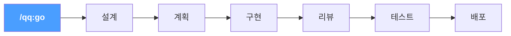

# 한국어

## 기능

**`/qq:go` — 라이프사이클 인식 라우팅.** 개발 주기에서 현재 위치를 감지하고 다음 단계를 제안한다. 설계 문서가 있다면? 계획을 제안. 코드가 작성되었다면? 리뷰를 제안. 테스트가 통과했다면? 배포를 제안.

**tykit — AI가 제어하는 Unity Editor.** Unity Editor 내부의 HTTP 서버. 어떤 AI 에이전트에서든 호출할 수 있다. 컴파일, 테스트 실행, Play Mode 제어, 콘솔 로그 읽기, GameObject 검색 및 검사 — 모두 `curl`로. SDK 불필요, UI 자동화 불필요. qq 없이도 단독으로 동작한다. **[mcp-unity](https://github.com/CoderGamester/mcp-unity)** 및 **[Unity-MCP](https://github.com/IvanMurzak/Unity-MCP)**를 대체 백엔드로도 사용 가능.

추가 기능: `.cs` 편집마다 자동 컴파일, EditMode + PlayMode 테스트 파이프라인, 크로스 모델 코드 리뷰(Claude + Codex + 검증), 전체 개발 라이프사이클을 커버하는 22개 스킬.

## 라이프사이클 파이프라인



`/qq:go`를 입력하면 qq가 프로젝트 상태를 읽고 적절한 단계로 라우팅한다. 각 단계가 다음을 제안. `--auto`로 전체 파이프라인을 자동 실행.

## 설치

**사전 요구사항:** macOS + Windows(Windows에서는 [Git for Windows](https://gitforwindows.org/) 필요), Unity 2021.3+, [Claude Code](https://docs.anthropic.com/en/docs/claude-code), curl, python3, jq. [Codex CLI](https://github.com/openai/codex)는 선택(크로스 모델 리뷰용). *Windows 지원은 미리보기 단계입니다 — 앞으로 몇 주에 걸쳐 안정화 예정.*

**1단계 — 플러그인(스킬 + 훅):**
```
/plugin marketplace add tykisgod/quick-question
/plugin install qq@quick-question-marketplace
```

**2단계 — tykit(Unity 패키지):**

> 2단계는 선택사항. 스킬만 사용한다면 불필요 — tykit은 Unity Editor 직접 제어를 추가한다.

```bash
git clone https://github.com/tykisgod/quick-question.git /tmp/qq-install
/tmp/qq-install/install.sh --profile feature /path/to/your-unity-project
rm -rf /tmp/qq-install
```

설치를 질문형으로 진행하고 싶다면 마법사를 쓰면 됩니다.

```bash
git clone https://github.com/tykisgod/quick-question.git /tmp/qq-install
/tmp/qq-install/install.sh --wizard /path/to/your-project
rm -rf /tmp/qq-install
```

마법사는 현재 엔진을 자동 감지하고, `LC_ALL` / `LC_MESSAGES` / `LANG` 값으로 표시 언어도 자동 선택합니다. 필요하면 `--language en|zh-CN|ja|ko` 로 고정할 수 있습니다.

질문 없이 추천 구성을 바로 적용하려면:

```bash
/tmp/qq-install/install.sh --preset quickstart /path/to/your-project
/tmp/qq-install/install.sh --preset daily /path/to/your-project
/tmp/qq-install/install.sh --preset stabilize /path/to/your-project
```

추천 의미는 다음과 같습니다.

- `quickstart` — 가장 가벼움. 첫 설치나 프로토타입용
- `daily` — 추천 기본값. 대부분의 일상 개발용
- `stabilize` — 더 안전함. 큰 변경이나 릴리스 직전용

공유 방향 문서는 [Core Roadmap](core-roadmap.md) 하나만 유지합니다. `install.sh --profile <lightweight|core|feature|hardening>` 로 starter `default_profile` 을 설정할 수 있습니다. 설치기는 이제 엔진, 호스트, `qq.yaml install` 에 맞는 runtime modules 만 프로젝트에 복사합니다. 공유 설정은 `qq.yaml`, worktree별 오버라이드는 `.qq/local.yaml` 이 기본입니다.

## 빠른 시작

```bash
/qq:go                  # 지금 어디? 다음에 뭘 해야 하지?
/qq:go "add health system"   # 아이디어에서 시작
/qq:go --auto design.md      # 전체 파이프라인 자동 실행
```

또는 아무 스킬이나 직접 사용:
```bash
/qq:add-tests                 # 먼저 타겟 테스트 커버리지 추가
/qq:test                      # 테스트 실행
/qq:best-practice             # 18개 규칙 빠른 점검
/qq:codex-code-review         # 크로스 모델 리뷰
/qq:commit-push               # 배포
```

## MCP 지원

qq는 타사 MCP Unity 서버를 tykit의 대안으로 지원합니다:

- **[mcp-unity](https://github.com/CoderGamester/mcp-unity)** — Node.js + WebSocket 브리지 (Unity 6+ 필요)
- **[Unity-MCP](https://github.com/IvanMurzak/Unity-MCP)** — 독립 서버, Docker/원격 지원

Claude Code에서 MCP를 사용할 때는 먼저 내장 `tykit_mcp` 브리지의 `unity_*` 도구를 우선 사용하세요. mcp-unity 와 Unity-MCP 는 계속 호환 fallback 으로 사용할 수 있습니다.

**tykit 은 계속 표준 백엔드입니다.** 내장 `tykit_mcp` 는 tykit 을 MCP 로 노출하는 래퍼일 뿐이며 tykit 을 대체하지 않습니다. mcp-unity는 Unity 6+ 필요. Unity-MCP는 버전 제한 없음. qq 자체는 Unity 2021.3+ 지원.
