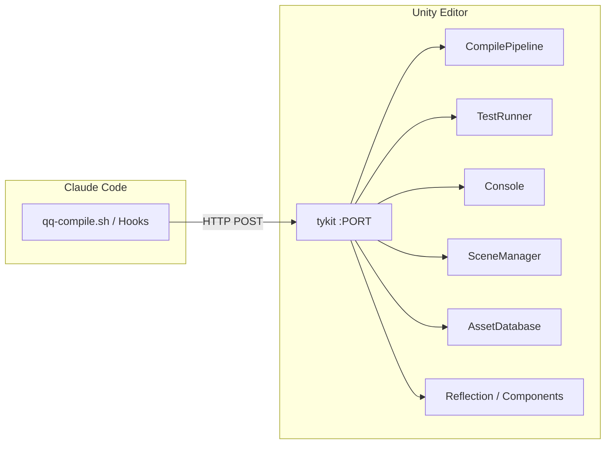

# tykit API Reference

tykit is a standalone HTTP server that auto-starts inside Unity Editor. **Any AI agent** (Claude Code, Codex, custom tools) can control Unity via simple HTTP calls — no SDK, no plugin API, no UI automation.

You can use tykit independently or as part of quick-question. When used with qq, it powers auto-compilation and test execution.

Current tykit version: **v0.5.0**.

## Standalone Install

No need to install quick-question. Just add one line to your Unity project's `Packages/manifest.json`:

```json
"com.tyk.tykit": "https://github.com/tykisgod/tykit.git"
```

Open Unity — tykit starts automatically. Port is stored in `Temp/tykit.json`.

## Two HTTP Channels

tykit listens on a single port but exposes **two parallel command channels**:

| Channel | Endpoint | Runs on | When to use |
|---|---|---|---|
| **Main-thread queue** | `POST /` | Unity main thread (queued) | Normal commands — anything that touches scenes, assets, or Editor state |
| **Listener-thread direct** | `GET /ping`, `/health`, `/focus-unity`, `/dismiss-dialog` | Listener thread | When the main thread is blocked (modal dialog, domain reload, background throttling) |

**This is the differentiator.** When a modal dialog blocks Unity's main thread, every other Unity bridge dies — they all queue commands on the main thread that's already stuck. tykit's listener thread stays alive and can drag Unity back into a working state. See [Main Thread Recovery](#main-thread-recovery) below.

## Quick Start

**Compile and check:**
```bash
PORT=$(python3 -c "import json; print(json.load(open('Temp/tykit.json'))['port'])")
curl -s -X POST http://localhost:$PORT/ \
  -d '{"command":"compile"}' -H 'Content-Type: application/json'
curl -s -X POST http://localhost:$PORT/ \
  -d '{"command":"get-compile-result"}' -H 'Content-Type: application/json'
```

**Run tests and poll results:**
```bash
curl -s -X POST http://localhost:$PORT/ \
  -d '{"command":"run-tests","args":{"mode":"editmode"}}' -H 'Content-Type: application/json'
curl -s -X POST http://localhost:$PORT/ \
  -d '{"command":"get-test-result"}' -H 'Content-Type: application/json'
```

**Find an object and inspect it:**
```bash
curl -s -X POST http://localhost:$PORT/ \
  -d '{"command":"find","args":{"name":"Player"}}' -H 'Content-Type: application/json'
curl -s -X POST http://localhost:$PORT/ \
  -d '{"command":"inspect","args":{"id":12345}}' -H 'Content-Type: application/json'
```

**Call a method via reflection** (v0.4.0 — finally makes runtime testing viable without code scaffolding):
```bash
curl -s -X POST http://localhost:$PORT/ \
  -d '{"command":"call-method","args":{"id":12345,"component":"PlayerHealth","method":"TakeDamage","parameters":[10]}}' \
  -H 'Content-Type: application/json'
```

## Main Thread Recovery

(v0.5.0) When a `POST /` command times out — most commonly because Unity is showing a modal dialog ("Save modified scenes?", a compile error popup, the asset import progress bar) or because Unity is background-throttling a domain reload — the **listener-thread GET endpoints** can drag Unity back into a working state without depending on the main thread:

| Endpoint | Effect | Platform |
|---|---|---|
| `GET /ping` | Listener thread pong (proves the server is alive) | All |
| `GET /health` | Returns queue depth + time since last main-thread tick + `mainThreadBlocked` heuristic | All |
| `GET /focus-unity` | `SetForegroundWindow` on Unity's main window — unsticks background-throttled operations like domain reload and `git` package resolve | Windows only |
| `GET /dismiss-dialog` | Posts `WM_CLOSE` to the foreground dialog owned by Unity — closes "Save Scene?" / compile error popups / import errors | Windows only |

**Recovery workflow** when a `POST /` command hangs:

```bash
PORT=$(python3 -c "import json; print(json.load(open('Temp/tykit.json'))['port'])")

curl -s http://localhost:$PORT/ping            # listener alive?
curl -s http://localhost:$PORT/health          # mainThreadBlocked: true/false?
curl -s http://localhost:$PORT/focus-unity     # background throttled? bring Unity to front
curl -s http://localhost:$PORT/dismiss-dialog  # modal dialog? close it
```

The main-thread variants (`{"command":"focus-unity"}` / `{"command":"dismiss-dialog"}`) are convenience wrappers when the main thread is responsive. When it's blocked, use the GET endpoints.

`play` and `open-scene` (v0.5.0) auto-save dirty scenes first, which prevents the "Save modified scenes?" modal from blocking tykit in the first place. The main thread also publishes a heartbeat every tick so the listener thread can detect stalls reliably.

## Full API Reference

### Diagnostics

| Command | Args | Description |
|---------|------|-------------|
| `status` | — | Editor state overview (isPlaying, isCompiling, activeScene) |
| `commands` | — | List all registered commands |
| `compile-status` | — | Current compilation state |
| `get-compile-result` | — | Last compile result with errors and duration |

### Compile and Test

| Command | Args | Description |
|---------|------|-------------|
| `compile` | — | Trigger compilation |
| `run-tests` | `mode`, `filter`, `assemblyNames` | Start EditMode/PlayMode tests |
| `get-test-result` | `runId` (optional) | Poll test results |

### Console

| Command | Args | Description |
|---------|------|-------------|
| `console` | `count`, `filter` | Read recent console entries |
| `clear-console` | — | Clear console buffer |

### Scene and Hierarchy

| Command | Args | Description |
|---------|------|-------------|
| `find` | `name` / `type` / `tag` / `parentId` / `path` / `includeInactive` | Find GameObjects (v0.4 added scoping + inactive support) |
| `select` | `id` / `ids` (multi) / `ping` | Select object(s) in the editor (v0.4 added multi-select) |
| `ping` | `id` / `assetPath` | Highlight without selecting (v0.4) |
| `inspect` | `id` / `name` | Inspect components — now includes `children` array (v0.3) |
| `hierarchy` | `depth` / `id` / `path` / `name` | Scene hierarchy tree, optionally subtree (v0.3) |

### GameObject Lifecycle

| Command | Args | Description |
|---------|------|-------------|
| `create` | `name`, `primitiveType`, `position` | Create GameObject |
| `instantiate` | `prefab`, `name` | Instantiate prefab |
| `destroy` | `id` | Destroy GameObject |
| `set-transform` | `id`, `position`, `rotation`, `scale` | Modify transform |
| `set-name` | `id`, `name` | Rename GameObject (v0.3) |

### Components

| Command | Args | Description |
|---------|------|-------------|
| `add-component` | `id`, `component` | Add component to GameObject |
| `component-copy` | `id`, `component` | Copy component values via `ComponentUtility` (v0.5) |
| `component-paste` | `id`, `component` / `asNew` | Paste copied component, or add as new (v0.5) |

### Properties (Serialized)

| Command | Args | Description |
|---------|------|-------------|
| `get-properties` | `id` / `structured: true` | List serialized properties; `structured` returns native JSON types instead of stringified format (v0.3) |
| `set-property` | `id`, `component`, `property`, `value` | Set serialized property — accepts native JSON for `Vector*` / `Quaternion` / `Color` / `Rect` / `Bounds` (v0.3) and `LayerMask` / `ArraySize` (v0.5) |

### Reflection (Code-Level)

> v0.4.0 — bypasses SerializedProperty entirely. Walks the type hierarchy for inherited private members. Finally makes runtime testing viable without scaffolding code into your project.

| Command | Args | Description |
|---------|------|-------------|
| `call-method` | `id`, `component`, `method`, `parameters` | Invoke any public or non-public method via reflection. Parameters as JSON array, return value serialized to JSON. |
| `get-field` | `id`, `component`, `field` | Read code-level field or property |
| `set-field` | `id`, `component`, `field`, `value` | Write code-level field or property |

### Arrays

| Command | Args | Description |
|---------|------|-------------|
| `get-array` | `id`, `component`, `property` | Read entire serialized array/list as structured JSON, with nested struct/class elements fully expanded (v0.4) |
| `array-size` | `id`, `component`, `property` / `size` | Read or set serialized array size (v0.3) |
| `array-insert` | `id`, `component`, `property`, `index`, `value` | Insert element at index, optionally assigning a value (v0.3) |
| `array-delete` | `id`, `component`, `property`, `index` | Delete element from array (v0.3) |
| `array-move` | `id`, `component`, `property`, `from`, `to` | Reorder via `MoveArrayElement` (v0.4) |

### Prefabs (v0.5)

| Command | Args | Description |
|---------|------|-------------|
| `prefab-apply` | `id` | Commit scene changes to source prefab asset |
| `prefab-revert` | `id` | Revert instance changes to prefab source |
| `prefab-open` | `path` | Enter prefab edit mode |
| `prefab-close` | `save` (bool) | Exit prefab edit mode |
| `prefab-source` | `id` | Get source prefab asset path of an instance |

### Physics Queries (v0.5)

| Command | Args | Description |
|---------|------|-------------|
| `raycast` | `origin`, `direction`, `maxDistance`, `layerMask` | Single raycast, returns first hit |
| `raycast-all` | `origin`, `direction`, `maxDistance`, `layerMask` | Returns all hits along ray |
| `overlap-sphere` | `position`, `radius`, `layerMask` | Returns colliders intersecting a sphere |

### Assets (v0.5)

| Command | Args | Description |
|---------|------|-------------|
| `find-assets` | `type`, `folder`, `name` | `AssetDatabase.FindAssets` wrapper, returns paths/GUIDs/instanceIds |
| `create-scriptable-object` | `type`, `path` | Create and save a `ScriptableObject` instance as a project asset |
| `load-asset` | `path` | Resolve asset by path → name/instanceId/type |
| `refresh` | — | `AssetDatabase.Refresh()` |

### UI

| Command | Args | Description |
|---------|------|-------------|
| `set-text` | `id`, `text`, `inChildren` | Set text on `TMP_Text` / `TextMeshProUGUI` / `Text` without needing the serialized property name (v0.3) |
| `button-click` | `id` | Simulate clicking a UI Button via `onClick.Invoke()`. Respects `interactable` state. (v0.5) |

### Editor Control

| Command | Args | Description |
|---------|------|-------------|
| `play` | — | Enter Play Mode (auto-saves dirty scenes first, v0.5) |
| `stop` | — | Exit Play Mode |
| `pause` | — | Pause Play Mode |
| `save-scene` | — | Save current scene |
| `save-scene-as` | `path` | Save active scene to a new path (v0.5) |
| `set-active-scene` | `path` / `name` | Switch active scene in multi-scene setups (v0.5) |
| `open-scene` | `path` | Open scene by asset path (auto-saves dirty scenes first, v0.5) |
| `menu` | `item` | Execute menu item |
| `focus-unity` | — | Bring Unity to foreground (Windows; main-thread variant — see Recovery section for the listener-thread version) (v0.5) |
| `dismiss-dialog` | — | Close foreground modal dialog (Windows; main-thread variant) (v0.5) |

### Prefs (v0.5)

| Command | Args | Description |
|---------|------|-------------|
| `editor-prefs` | `action: get/set/delete`, `key`, `value` | Read/write/delete `EditorPrefs`. Auto-detects value type from JSON. |
| `player-prefs` | `action: get/set/delete`, `key`, `value` | Read/write/delete `PlayerPrefs`. Auto-detects value type from JSON. |

### Batch

| Command | Args | Description |
|---------|------|-------------|
| `batch` | `commands` (array), `stopOnError` | Execute multiple commands in one HTTP round-trip. `$N` references the `instanceId` from the Nth command. Reduces 30+ calls to 1 round-trip. |

## How quick-question Uses tykit

When qq's auto-compile hook fires, it tries tykit first — a single HTTP call that triggers incremental compilation without stealing keyboard focus. If tykit isn't available, it falls back to osascript/PowerShell editor trigger or batch mode (the `unity-compile-smart.sh` three-tier fallback). Tests via `/qq:test` also run through tykit for fast, non-blocking execution.

The qq runtime's multi-engine `qq-compile.sh` dispatcher (added in v1.16.x) routes Unity compiles through tykit while delegating Godot/Unreal/S&box to their own bridges. This is why qq is significantly faster than batch-mode alternatives on Unity.


