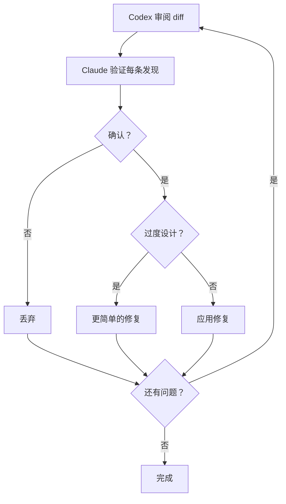

# 跨模型审阅（Codex Tribunal）

> 本文档涵盖两种审阅模式：跨模型（Codex）和 Claude 审阅。两者共享相同的验证循环、门机制和轮数限制。

单模型代码审阅有盲区。模型审阅自己的输出时，往往和写代码时共享相同的假设。跨模型审阅通过让 Codex 独立审阅 diff、Claude 对照源码验证每条发现来解决这个问题。两个模型各自捕获对方遗漏的问题，比任何单一模型都能产生更高置信度的结果。

## Tribunal 流程

跨模型审阅（`/qq:codex-code-review`）以最多 5 轮的自动循环运行：

1. Claude 通过 `code-review.sh` 将 diff 发送给 Codex CLI 审阅
2. Codex 返回按严重程度分类的发现（Critical、Moderate、Suggestion）
3. 审阅门激活——Edit 和 Write 操作被阻止
4. Claude 派发并行子 agent，对照实际源码验证每条发现
5. 每个子 agent 执行过度设计检查：提议的修复是否与问题成比例？
6. 确认的关键问题被修复；过度设计的建议获得更简单的替代方案
7. 所有验证子 agent 完成后门解锁
8. 循环重复，直到没有关键问题或达到 5 轮上限

## 审阅门机制

审阅门是一个机械约束，在发现未经验证时阻止代码编辑。

- **门文件：** `$QQ_TEMP_DIR/review-gate-$PPID`
- **格式：** `<ts>:<completed>:<expected>` — 时间戳、已完成验证子 agent 数、预期总数
- **激活：** PostToolUse hook 在 `code-review.sh`、`claude-review.sh`、`plan-review.sh` 或 `claude-plan-review.sh` 运行后设置门
- **效果：** PreToolUse hook 阻止所有对 `.cs` 和 `Docs/*.md` 文件的 Edit 和 Write 操作
- **释放：** 所有验证子 agent 完成后门解锁（`completed >= expected`），由 PostToolUse Agent hook 追踪
- **Stop hook：** `review-gate.sh stop` 在验证未完成时阻止会话退出
- **隔离：** 每个会话用 `$PPID` 划定门文件范围，并发会话互不干扰

审阅循环结束时门自动清理。

## 优先级分类

所有审阅命令——无论跨模型还是 Claude 单模型——都将发现分为三个层级：

| 优先级 | 范围 | 处理方式 |
|--------|------|---------|
| P0 | 架构变更、反模式、生命周期问题 | 必须审阅 |
| P1 | 业务逻辑、性能、错误处理 | 值得审阅 |
| P2 | Getter/Setter、日志、配置微调 | 快速扫一眼 |

只有 P0（Critical）发现触发自动修复和额外审阅轮次。P1 发现酌情修复。P2 发现报告但通常不处理。

## Claude 审阅替代方案

`/qq:claude-code-review` 使用 `claude-review.sh` 提供相同的审阅循环，该脚本调用 `claude -p` 作为进程隔离的审阅者。这与 Codex 路径在架构上是对称的：由独立进程执行初始审阅，然后验证子 agent 对照实际源码检查每条发现。验证步骤在结构上完全相同——并行子 agent 执行相同的过度设计检查——但因为审阅者和验证者属于同一模型家族，跨模型盲区互补的优势有所减弱。循环结构、审阅门、轮数限制和终止条件完全共享。

## 计划审阅

跨模型模式不仅限于代码。`/qq:codex-plan-review` 和 `/qq:claude-plan-review` 对设计文档和实现计划（而非代码 diff）应用相同的审阅-验证-修复循环。这能在问题进入实现之前就捕获架构层面的问题。

## 前置条件

- **Codex 审阅**（`/qq:codex-code-review`、`/qq:codex-plan-review`）：需要 Codex CLI（`npm install -g @openai/codex`）
- **Claude 审阅**（`/qq:claude-code-review`、`/qq:claude-plan-review`）：需要 Claude CLI（`claude`）
- **MCP 一次性审阅**：`qq_code_review` 和 `qq_plan_review` MCP 工具可供非 Claude 宿主使用（一次性执行，不含验证循环）

## 相关文档

- [Hook 系统](hooks.md) — 审阅门 hook（PreToolUse、PostToolUse、Stop）
- [架构总览](../dev/architecture/overview.md) — 审阅在插件层级中的位置
- [配置参考](configuration.md) — `policy_profile` 控制审阅强度
