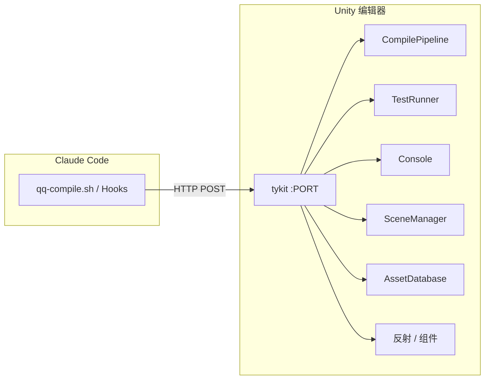

# tykit API 参考

tykit 是一个在 Unity 编辑器内自动启动的独立 HTTP 服务器。**任何 AI agent**（Claude Code、Codex、自定义工具）都可以通过简单的 HTTP 调用控制 Unity——不需要 SDK、不需要插件 API、不需要 UI 自动化。

你可以独立使用 tykit，也可以作为 quick-question 的一部分。搭配 qq 使用时，它驱动自动编译和测试执行。

当前 tykit 版本：**v0.5.0**。

## 独立安装

不需要安装 quick-question。只需在 Unity 项目的 `Packages/manifest.json` 中加一行：

```json
"com.tyk.tykit": "https://github.com/tykisgod/tykit.git"
```

打开 Unity——tykit 自动启动。端口存储在 `Temp/tykit.json`。

## 两个 HTTP 通道

tykit 在单个端口上暴露**两条并行命令通道**：

| 通道 | 端点 | 运行线程 | 何时使用 |
|---|---|---|---|
| **主线程队列** | `POST /` | Unity 主线程（排队） | 普通命令——任何接触场景、资源、Editor 状态的操作 |
| **监听线程直通** | `GET /ping`、`/health`、`/focus-unity`、`/dismiss-dialog` | 监听线程 | 主线程被卡住时（modal 对话框、domain reload、后台节流） |

**这是 tykit 的关键差异**。当 modal 对话框卡住 Unity 主线程时，所有其他 Unity 桥接都会死——它们都把命令排进已经卡住的主线程队列。tykit 的监听线程始终活着，可以把 Unity 拉回工作状态。参见下面的[主线程恢复](#主线程恢复)。

## 快速开始

**编译并检查：**
```bash
PORT=$(python3 -c "import json; print(json.load(open('Temp/tykit.json'))['port'])")
curl -s -X POST http://localhost:$PORT/ \
  -d '{"command":"compile"}' -H 'Content-Type: application/json'
curl -s -X POST http://localhost:$PORT/ \
  -d '{"command":"get-compile-result"}' -H 'Content-Type: application/json'
```

**运行测试并轮询结果：**
```bash
curl -s -X POST http://localhost:$PORT/ \
  -d '{"command":"run-tests","args":{"mode":"editmode"}}' -H 'Content-Type: application/json'
curl -s -X POST http://localhost:$PORT/ \
  -d '{"command":"get-test-result"}' -H 'Content-Type: application/json'
```

**查找对象并检视：**
```bash
curl -s -X POST http://localhost:$PORT/ \
  -d '{"command":"find","args":{"name":"Player"}}' -H 'Content-Type: application/json'
curl -s -X POST http://localhost:$PORT/ \
  -d '{"command":"inspect","args":{"id":12345}}' -H 'Content-Type: application/json'
```

**通过反射调用方法**（v0.4.0——让 AI 跑运行时测试无需在项目中预埋脚手架代码）：
```bash
curl -s -X POST http://localhost:$PORT/ \
  -d '{"command":"call-method","args":{"id":12345,"component":"PlayerHealth","method":"TakeDamage","parameters":[10]}}' \
  -H 'Content-Type: application/json'
```

## 主线程恢复

（v0.5.0）当 `POST /` 命令超时——最常见的原因是 Unity 弹出 modal 对话框（"Save modified scenes?"、编译错误弹窗、资源导入进度条）或者 domain reload 被后台节流——**监听线程的 GET 端点**可以在不依赖被卡住的主线程的情况下把 Unity 拉回工作状态：

| 端点 | 效果 | 平台 |
|---|---|---|
| `GET /ping` | 监听线程 pong（证明服务器还活着） | 全平台 |
| `GET /health` | 返回队列深度 + 距离上次主线程 tick 的时间 + `mainThreadBlocked` 启发式判断 | 全平台 |
| `GET /focus-unity` | 对 Unity 主窗口调用 `SetForegroundWindow`——解除后台节流的卡住操作（例如 domain reload 和 `git` 包解析） | 仅 Windows |
| `GET /dismiss-dialog` | 向 Unity 拥有的前台对话框发送 `WM_CLOSE`——关闭 "Save Scene?" / 编译错误弹窗 / 导入错误 | 仅 Windows |

**当 `POST /` 命令卡住时的恢复流程：**

```bash
PORT=$(python3 -c "import json; print(json.load(open('Temp/tykit.json'))['port'])")

curl -s http://localhost:$PORT/ping            # 监听线程还活着吗？
curl -s http://localhost:$PORT/health          # mainThreadBlocked: true/false?
curl -s http://localhost:$PORT/focus-unity     # 后台节流？把 Unity 拉到前台
curl -s http://localhost:$PORT/dismiss-dialog  # modal 对话框？关掉它
```

主线程版本（`{"command":"focus-unity"}` / `{"command":"dismiss-dialog"}`）是主线程响应正常时的便利包装。主线程被卡住时使用 GET 端点。

`play` 和 `open-scene`（v0.5.0）会先自动保存脏场景，从源头避免 "Save modified scenes?" modal 卡住 tykit。主线程也会每 tick 发布一次心跳，让监听线程能可靠地检测到主线程停滞。

## 完整 API 参考

### 诊断

| 命令 | 参数 | 描述 |
|------|------|------|
| `status` | — | Editor 状态概览（isPlaying、isCompiling、activeScene） |
| `commands` | — | 列出所有已注册命令 |
| `compile-status` | — | 当前编译状态 |
| `get-compile-result` | — | 最近一次编译结果（错误和耗时） |

### 编译与测试

| 命令 | 参数 | 描述 |
|------|------|------|
| `compile` | — | 触发编译 |
| `run-tests` | `mode`、`filter`、`assemblyNames` | 启动 EditMode/PlayMode 测试 |
| `get-test-result` | `runId`（可选） | 查询测试结果 |

### 控制台

| 命令 | 参数 | 描述 |
|------|------|------|
| `console` | `count`、`filter` | 读取最近控制台日志 |
| `clear-console` | — | 清空控制台缓冲区 |

### 场景与层级

| 命令 | 参数 | 描述 |
|------|------|------|
| `find` | `name` / `type` / `tag` / `parentId` / `path` / `includeInactive` | 查找 GameObject（v0.4 增加子树范围与 inactive 支持） |
| `select` | `id` / `ids`（多选）/ `ping` | 在编辑器中选中对象（v0.4 增加多选） |
| `ping` | `id` / `assetPath` | 高亮但不选中（v0.4） |
| `inspect` | `id` / `name` | 检视组件，v0.3 起返回 `children` 数组 |
| `hierarchy` | `depth` / `id` / `path` / `name` | 场景层级树，可选指定子树（v0.3） |

### GameObject 生命周期

| 命令 | 参数 | 描述 |
|------|------|------|
| `create` | `name`、`primitiveType`、`position` | 创建 GameObject |
| `instantiate` | `prefab`、`name` | 实例化预制体 |
| `destroy` | `id` | 销毁 GameObject |
| `set-transform` | `id`、`position`、`rotation`、`scale` | 修改 Transform |
| `set-name` | `id`、`name` | 重命名 GameObject（v0.3） |

### 组件

| 命令 | 参数 | 描述 |
|------|------|------|
| `add-component` | `id`、`component` | 添加组件 |
| `component-copy` | `id`、`component` | 通过 `ComponentUtility` 复制组件值（v0.5） |
| `component-paste` | `id`、`component` / `asNew` | 粘贴组件，或作为新组件添加（v0.5） |

### 属性（序列化）

| 命令 | 参数 | 描述 |
|------|------|------|
| `get-properties` | `id` / `structured: true` | 列出序列化属性；`structured` 返回原生 JSON 类型而非旧的字符串格式（v0.3） |
| `set-property` | `id`、`component`、`property`、`value` | 设置序列化属性——v0.3 起接受 `Vector*` / `Quaternion` / `Color` / `Rect` / `Bounds` 的原生 JSON，v0.5 起支持 `LayerMask` / `ArraySize` |

### 反射（代码层）

> v0.4.0 — 完全绕过 SerializedProperty。沿类型层级查找继承的私有成员。让"AI 跑运行时测试"无需在项目中预埋脚手架代码。

| 命令 | 参数 | 描述 |
|------|------|------|
| `call-method` | `id`、`component`、`method`、`parameters` | 通过反射调用任意 public/non-public 方法。参数为 JSON 数组，返回值序列化为 JSON。 |
| `get-field` | `id`、`component`、`field` | 读取代码层字段或属性 |
| `set-field` | `id`、`component`、`field`、`value` | 写入代码层字段或属性 |

### 数组

| 命令 | 参数 | 描述 |
|------|------|------|
| `get-array` | `id`、`component`、`property` | 读取整个序列化数组/列表为结构化 JSON，嵌套 struct/class 元素完全展开（v0.4） |
| `array-size` | `id`、`component`、`property` / `size` | 读或设置序列化数组大小（v0.3） |
| `array-insert` | `id`、`component`、`property`、`index`、`value` | 在指定索引插入元素，可选赋值（v0.3） |
| `array-delete` | `id`、`component`、`property`、`index` | 从数组中删除元素（v0.3） |
| `array-move` | `id`、`component`、`property`、`from`、`to` | 通过 `MoveArrayElement` 重排（v0.4） |

### 预制体（v0.5）

| 命令 | 参数 | 描述 |
|------|------|------|
| `prefab-apply` | `id` | 应用场景修改到源预制体资源 |
| `prefab-revert` | `id` | 回滚实例修改到预制体源 |
| `prefab-open` | `path` | 进入预制体编辑模式 |
| `prefab-close` | `save`（bool） | 退出预制体编辑模式 |
| `prefab-source` | `id` | 获取实例的源预制体资源路径 |

### 物理查询（v0.5）

| 命令 | 参数 | 描述 |
|------|------|------|
| `raycast` | `origin`、`direction`、`maxDistance`、`layerMask` | 单次射线检测，返回首个命中 |
| `raycast-all` | 同上 | 返回射线上所有命中 |
| `overlap-sphere` | `position`、`radius`、`layerMask` | 与球体相交的所有碰撞器 |

### 资源（v0.5）

| 命令 | 参数 | 描述 |
|------|------|------|
| `find-assets` | `type`、`folder`、`name` | `AssetDatabase.FindAssets` 包装，返回路径/GUID/instanceId |
| `create-scriptable-object` | `type`、`path` | 创建并保存 `ScriptableObject` 实例为项目资源 |
| `load-asset` | `path` | 按路径解析资源 → name/instanceId/type |
| `refresh` | — | `AssetDatabase.Refresh()` |

### UI

| 命令 | 参数 | 描述 |
|------|------|------|
| `set-text` | `id`、`text`、`inChildren` | 直接设置 `TMP_Text` / `TextMeshProUGUI` / `Text` 的文本，无需知道序列化属性名（v0.3） |
| `button-click` | `id` | 通过 `onClick.Invoke()` 模拟按钮点击。遵守 `interactable` 状态。（v0.5） |

### Editor 控制

| 命令 | 参数 | 描述 |
|------|------|------|
| `play` | — | 进入 Play Mode（v0.5 起会先自动保存脏场景） |
| `stop` | — | 退出 Play Mode |
| `pause` | — | 暂停 Play Mode |
| `save-scene` | — | 保存当前场景 |
| `save-scene-as` | `path` | 另存活动场景到新路径（v0.5） |
| `set-active-scene` | `path` / `name` | 在多场景设置中切换活动场景（v0.5） |
| `open-scene` | `path` | 按资源路径打开场景（v0.5 起会先自动保存脏场景） |
| `menu` | `item` | 执行菜单项 |
| `focus-unity` | — | 把 Unity 拉到前台（Windows；主线程版本——监听线程版本见 Recovery 章节）（v0.5） |
| `dismiss-dialog` | — | 关闭前台 modal 对话框（Windows；主线程版本）（v0.5） |

### Prefs（v0.5）

| 命令 | 参数 | 描述 |
|------|------|------|
| `editor-prefs` | `action: get/set/delete`、`key`、`value` | 读/写/删除 `EditorPrefs`。从 JSON 自动检测值类型。 |
| `player-prefs` | `action: get/set/delete`、`key`、`value` | 读/写/删除 `PlayerPrefs`。从 JSON 自动检测值类型。 |

### 批量执行

| 命令 | 参数 | 描述 |
|------|------|------|
| `batch` | `commands`（数组）、`stopOnError` | 一次 HTTP 往返执行多个命令。`$N` 引用第 N 个命令返回的 `instanceId`。把 30+ 次调用降到 1 次。 |

## quick-question 如何使用 tykit

当 qq 的自动编译 hook 触发时，首先尝试 tykit——一个 HTTP 调用即可触发增量编译，不会抢走键盘焦点。tykit 不可用时，回退到 osascript / PowerShell editor trigger 或批处理模式（`unity-compile-smart.sh` 的三层 fallback）。`/qq:test` 的测试也通过 tykit 运行，实现快速、非阻塞执行。

qq 运行时的多引擎 `qq-compile.sh` dispatcher（v1.16.x 引入）将 Unity 编译路由到 tykit，同时把 Godot/Unreal/S&box 委托给它们各自的桥接。这就是 qq 在 Unity 上比批处理模式方案快得多的原因。


